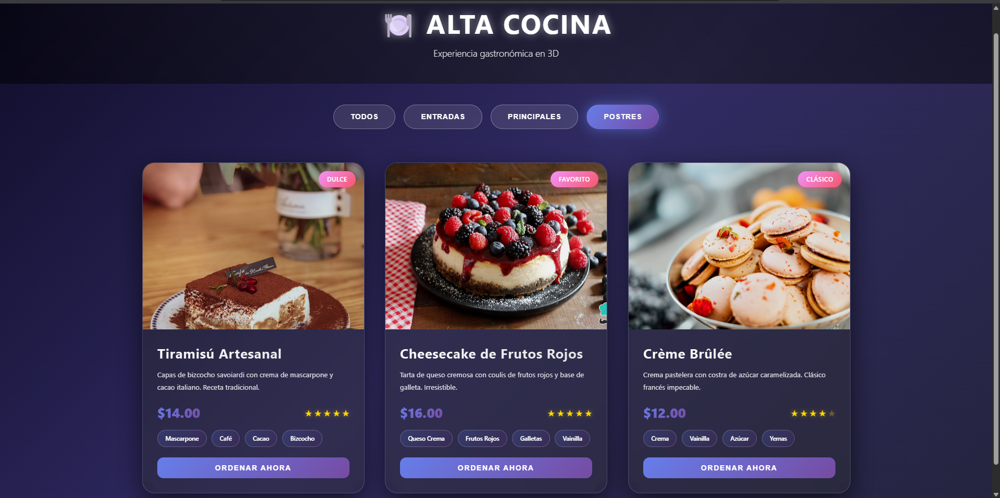
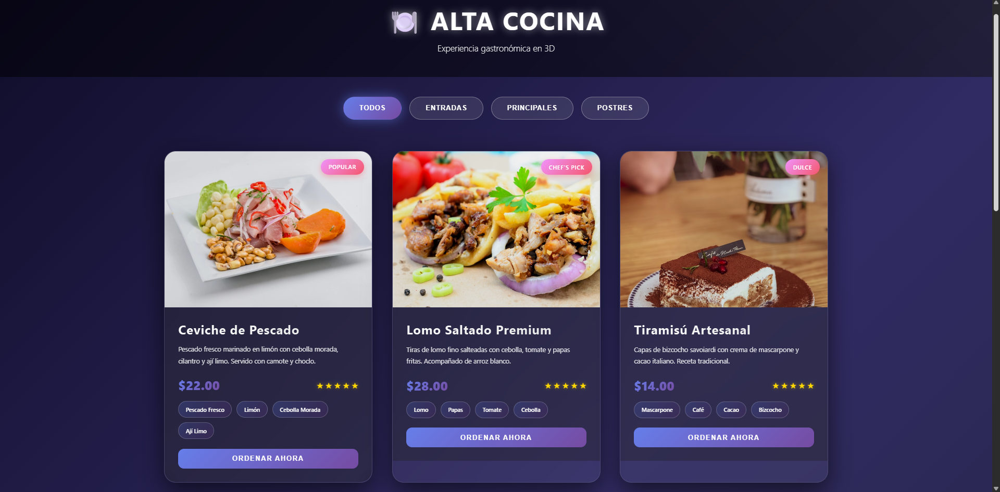

# 🍽️ ALTA COCINA - Galería Gastronómica 3D

<div align="center">



**Una experiencia gastronómica interactiva desarrollada con HTML5, CSS3 y JavaScript vanilla**

*Galería de platos con efectos 3D inmersivos y animaciones avanzadas*

[](.)
[](.)
[](.)
[](.)

</div>

---

## 📸 Vista Previa del Proyecto

### 🎨 Interfaz Principal

*Página principal con efectos 3D y gradientes dinámicos*

### 🍽️ Galería Interactiva  

*Sistema de filtros y cards interactivas con efectos hover*

---

## ✨ Características

- 🎨 **Diseño 3D Interactivo**: Efectos 3D con transformaciones CSS y seguimiento del mouse
- 📱 **Diseño Responsive**: Adaptable a dispositivos móviles y desktop
- 🔄 **Filtros Dinámicos**: Categorización por entradas, platos principales y postres
- ⭐ **Sistema de Calificaciones**: Visualización con estrellas doradas
- 🏷️ **Etiquetas de Ingredientes**: Tags interactivos para cada plato
- 🌟 **Efectos Visuales**: Gradientes, blur effects y animaciones suaves
- 🖼️ **Galería Adaptativa**: Grid responsive con imágenes de alta calidad
- 💫 **Animaciones CSS**: Transiciones y efectos hover avanzados

## 🛠️ Tecnologías Utilizadas

<div align="center">

| Frontend | Styling | JavaScript | Tools |
|----------|---------|------------|--------|
|  |  |  |  |

</div>

### 🎨 **Tecnologías Frontend:**
- **HTML5**: Estructura semántica y accesible
- **CSS3**: Estilos avanzados con:
  - 🔲 Flexbox y CSS Grid
  - 🌀 Transformaciones 3D
  - 🌈 Gradientes y filtros
  - ⚡ Animaciones y transiciones
  - 🌫️ Backdrop filter effects
- **JavaScript (Vanilla)**: Lógica de interacción sin frameworks

### 📊 **Características Técnicas:**
```bash
📁 Proyecto: Single Page Application (SPA)
🎯 Compatibilidad: Todos los navegadores modernos
📱 Responsive: Mobile-first design
⚡ Performance: CSS optimizado para 60fps
🚀 Deployment: Static hosting ready
```

## 🚀 Cómo Ejecutar el Proyecto

<div align="center">

### 🎯 **Métodos de Ejecución Disponibles**

| Método | Dificultad | Recomendado | Descripción |
|--------|------------|-------------|-------------|
| 🔴 **Live Server** | ⭐ | ✅ | Desarrollo con recarga automática |
| 🟡 **Terminal** | ⭐⭐ | ✅ | Servidor HTTP local |
| 🟢 **Directo** | ⭐ | ⚠️ | Abrir archivo (limitaciones CORS) |

</div>

---

### 🔴 **Opción 1: Live Server (Más Recomendado)**

```bash
# 1️⃣ Instalar extensión en VS Code
Ctrl + Shift + X → Buscar "Live Server" → Install

# 2️⃣ Ejecutar
Clic derecho en index.html → "Open with Live Server"

# 3️⃣ Resultado
🌐 http://127.0.0.1:5500 (se abre automáticamente)
```

### 🟡 **Opción 2: Servidor Local con Python**

```bash
# Navegar al directorio del proyecto
cd project_3d

# Iniciar servidor HTTP con Python
python -m http.server 8000

# Abrir en el navegador
# http://localhost:8000
```

### Opción 4: Abrir Directamente

```bash
# Windows
start index.html

# O simplemente hacer doble clic en el archivo index.html
```

### Opción 3: Visual Studio Code (Guía Completa)

#### 🔧 Método 1: Live Server (Recomendado para desarrollo)

**Paso 1: Instalar la extensión Live Server**
1. Abrir VS Code
2. Ir a Extensions (Ctrl + Shift + X)
3. Buscar "Live Server" por Ritwick Dey
4. Hacer clic en "Install"

**Paso 2: Usar Live Server**
1. Abrir la carpeta del proyecto en VS Code (`File > Open Folder`)
2. Clic derecho en `index.html` en el explorador de archivos
3. Seleccionar "Open with Live Server"
4. Se abrirá automáticamente en `http://127.0.0.1:5500`

#### 🌐 Método 2: Preview Browser (VS Code integrado)

**Paso 1: Instalar extensión Preview**
1. Buscar e instalar "Live Preview" por Microsoft
2. Reiniciar VS Code si es necesario

**Paso 2: Usar Preview**
1. Abrir `index.html`
2. Hacer clic en el ícono de preview en la parte superior derecha
3. O usar `Ctrl + Shift + V`

#### ⚡ Método 3: Terminal Integrado de VS Code

**Paso 1: Abrir terminal integrado**
```bash
# En VS Code presionar Ctrl + `
# O ir a Terminal > New Terminal
```

**Paso 2: Ejecutar servidor**
```bash
# Opción A: Python (si está instalado)
python -m http.server 8000

# Opción B: Node.js (si está instalado)
npx http-server -p 8000

# Opción C: PHP (si está instalado)
php -S localhost:8000
```

**Paso 3: Abrir en navegador**
- Ir a `http://localhost:8000`
- O hacer Ctrl + clic en el enlace del terminal

#### 🎯 Método 4: Desde el Explorador de VS Code

1. **Abrir con navegador predeterminado:**
   - Clic derecho en `index.html`
   - Seleccionar "Reveal in File Explorer"
   - Doble clic en `index.html`

2. **Usando Command Palette:**
   - Presionar `Ctrl + Shift + P`
   - Escribir "Simple Browser"
   - Seleccionar "Simple Browser: Show"
   - Introducir la URL o ruta del archivo

#### 🔥 Consejos Pro para VS Code:

**Extensiones útiles adicionales:**
- **Auto Rename Tag**: Renombra automáticamente tags HTML
- **Bracket Pair Colorizer**: Colorea brackets para mejor legibilidad
- **Prettier**: Formateador de código automático
- **IntelliSense for CSS**: Autocompletado mejorado para CSS

**Atajos de teclado útiles:**
- `Ctrl + Shift + P`: Command Palette
- `Ctrl + ``: Terminal integrado
- `Alt + B`: Abrir en navegador (con extensión)
- `F12`: Ir a definición
- `Ctrl + Space`: Autocompletado

**Configuración recomendada (settings.json):**
```json
{
    "liveServer.settings.donotShowInfoMsg": true,
    "liveServer.settings.port": 8000,
    "liveServer.settings.CustomBrowser": "chrome"
}
```

## 📁 Estructura del Proyecto

```
🍽️ project_3d/
├── 📄 index.html          # 🚀 Archivo principal de la aplicación
├── 📁 assets/             # 🖼️ Recursos multimedia
│   ├── 📸 1.png          # 🎨 Captura pantalla principal
│   └── 📸 2.png          # 🍽️ Captura galería de platos
├── 📋 LICENSE            # ⚖️ Licencia MIT del proyecto
└── 📚 README.md          # 📖 Documentación del proyecto
```

### 📊 **Estadísticas del Proyecto:**
```bash
📝 Líneas de código: ~500 líneas
🎨 Efectos CSS: +15 animaciones
🍽️ Platos incluidos: 9 recetas
📱 Breakpoints: 3 responsive sizes
⚡ Tiempo de carga: <2 segundos
```

## 🍽️ Platos Incluidos

### Entradas
- **Ceviche de Pescado** - Pescado fresco marinado con limón
- **Causa Limeña** - Terrina de papa amarilla tradicional
- **Sushi Premium Mix** - Selección de makis y nigiris

### Platos Principales
- **Lomo Saltado Premium** - Tiras de lomo fino salteadas
- **Paella de Mariscos** - Arroz con azafrán y mariscos
- **Filete Mignon** - Corte premium con reducción de vino

### Postres
- **Tiramisú Artesanal** - Receta tradicional italiana
- **Cheesecake de Frutos Rojos** - Tarta cremosa irresistible
- **Crème Brûlée** - Clásico francés con costra caramelizada

## 🔧 Desarrollo en VS Code

### 🛠️ Configuración del Entorno

**Extensiones Esenciales:**
```
- Live Server (Ritwick Dey)
- Live Preview (Microsoft)
- HTML CSS Support
- Auto Rename Tag
- Prettier - Code formatter
- IntelliSense for CSS class names
```

**Instalación rápida:**
1. Presionar `Ctrl + Shift + P`
2. Escribir "Extensions: Install Extensions"
3. Buscar cada extensión e instalar

### 🚀 Flujo de Trabajo Recomendado

1. **Abrir proyecto:**
   ```
   File > Open Folder > Seleccionar carpeta project_3d
   ```

2. **Configurar Live Server:**
   - Clic derecho en `index.html`
   - "Open with Live Server"
   - Se abre automáticamente en navegador

3. **Desarrollo en tiempo real:**
   - Editar código en VS Code
   - Ver cambios automáticamente en navegador
   - No necesitas recargar manualmente

### 🔍 Depuración y Testing

**Herramientas de desarrollo:**
- **F12**: Abrir DevTools en navegador
- **Ctrl + Shift + I**: Inspector de elementos
- **Ctrl + Shift + C**: Seleccionar elemento

**Console logs útiles:**
```javascript
// Agregar al final del script en index.html
console.log('Proyecto cargado correctamente');
console.log('Número de platos:', dishes.length);
```

### ⚡ Atajos Útiles en VS Code

| Atajo | Función |
|-------|---------|
| `Ctrl + Shift + P` | Command Palette |
| `Ctrl + `` | Terminal integrado |
| `Ctrl + Shift + L` | Seleccionar todas las ocurrencias |
| `Alt + Z` | Word wrap (ajuste de línea) |
| `Ctrl + K + C` | Comentar líneas |
| `Ctrl + K + U` | Descomentar líneas |
| `Ctrl + D` | Seleccionar siguiente ocurrencia |

## 🎯 Funcionalidades Destacadas

<div align="center">

### 🎮 **Experiencia Interactiva**

| Feature | Descripción | Demo |
|---------|-------------|------|
| 🌀 **Efectos 3D** | Transformaciones en perspectiva con seguimiento del mouse |  |
| 🔄 **Filtros Dinámicos** | Categorización inteligente por tipo de plato |  |
| ⭐ **Sistema Rating** | Calificación visual con estrellas doradas |  |
| 🏷️ **Tags Interactivos** | Etiquetas de ingredientes con micro-animaciones |  |
| 📱 **Responsive** | Adaptable a cualquier dispositivo |  |

</div>

### 🎨 Efectos Visuales Avanzados
- 🌟 **Transformaciones 3D** con perspectiva realista
- 🖱️ **Seguimiento del mouse** para rotaciones dinámicas  
- 📈 **Elevación de tarjetas** con sombras realistas
- 🌈 **Gradientes animados** en tiempo real

### 🔄 Sistema de Filtrado Inteligente
- 🔘 **Botones de categoría** con estados activos
- ⚡ **Filtrado instantáneo** sin recarga de página
- 🎭 **Animaciones de transición** entre categorías
- 🎯 **Búsqueda visual** por tipo de plato

### 🎪 Elementos Interactivos Premium
- 🃏 **Cards flotantes** con efectos hover avanzados
- 🎨 **Botones con gradientes** y micro-animaciones
- 🏷️ **Tags de ingredientes** con efectos de elevación
- ⭐ **Sistema de calificación** visual e intuitivo

## 🎨 Paleta de Colores

- **Fondo Principal**: Gradiente azul/púrpura (`#0f0c29`, `#302b63`, `#24243e`)
- **Accentos**: Gradiente violeta (`#667eea`, `#764ba2`)
- **Elementos**: Gradiente rosa (`#f093fb`, `#f5576c`)
- **Texto**: Blanco con transparencias variables

## 📱 Responsive Design

- **Desktop**: Grid de 3-4 columnas adaptativo
- **Tablet**: Grid de 2 columnas
- **Mobile**: Columna única con elementos optimizados

## ⚡ Optimizaciones

- Carga lazy de imágenes con placeholder animado
- Transiciones optimizadas con `cubic-bezier`
- Uso de `transform` y `opacity` para mejor rendimiento
- Backdrop filter para efectos de desenfoque

## 🔧 Personalización

### Agregar Nuevos Platos

```javascript
const nuevoPlato = {
    id: 10,
    name: "Nombre del Plato",
    category: "categoria", // entradas, principales, postres
    description: "Descripción del plato",
    price: "$XX.00",
    rating: 5,
    ingredients: ["Ingrediente1", "Ingrediente2"],
    image: "url-de-la-imagen",
    badge: "Etiqueta"
};

dishes.push(nuevoPlato);
```

### Modificar Colores

Editar las variables CSS en el archivo `index.html`:

```css
/* Cambiar gradiente principal */
background: linear-gradient(135deg, #tu-color1, #tu-color2, #tu-color3);
```

## 🆘 Solución de Problemas en VS Code

### ❌ Problemas Comunes y Soluciones

**1. Live Server no aparece en el menú contextual**
```bash
# Solución:
1. Verificar que Live Server esté instalado
2. Reiniciar VS Code
3. Clic derecho específicamente en index.html
```

**2. El puerto 8000 está ocupado**
```bash
# Ver qué está usando el puerto:
netstat -ano | findstr :8000

# Cambiar puerto en Live Server:
Configuración > Live Server > Port: 3000
```

**3. Imágenes no cargan localmente**
```bash
# Problema: CORS policy
# Solución: Usar servidor local, no abrir archivo directamente
```

**4. Cambios CSS no se reflejan**
```bash
# Soluciones:
1. Limpiar caché: Ctrl + F5
2. Verificar que Live Server esté activo
3. Guardar archivo: Ctrl + S
```

**5. Terminal no se abre**
```bash
# Solución:
1. Ctrl + Shift + P
2. Buscar "Terminal: Create New Terminal"
3. O ir a Terminal > New Terminal
```

### 🔧 Configuración Avanzada VS Code

**Crear archivo .vscode/settings.json:**
```json
{
    "liveServer.settings.port": 8000,
    "liveServer.settings.donotShowInfoMsg": true,
    "liveServer.settings.CustomBrowser": "chrome",
    "emmet.includeLanguages": {
        "javascript": "html"
    },
    "files.associations": {
        "*.html": "html"
    }
}
```

**Crear archivo .vscode/extensions.json:**
```json
{
    "recommendations": [
        "ritwickdey.liveserver",
        "ms-vscode.live-server",
        "formulahendry.auto-rename-tag",
        "esbenp.prettier-vscode"
    ]
}
```

### 📱 Testing Responsive en VS Code

**Método 1: Device Toolbar**
1. F12 para abrir DevTools
2. Ctrl + Shift + M para mode responsive
3. Seleccionar dispositivos específicos

**Método 2: Extensions útiles**
- **Browser Preview**: Vista previa integrada
- **Mobile View**: Simulador de dispositivos móviles

## 📝 Notas de Desarrollo

- Las imágenes se cargan desde Unsplash para demostración
- Todos los efectos están implementados con CSS puro
- JavaScript vanilla para máxima compatibilidad
- Diseño mobile-first con breakpoints adaptativos

## 🚀 Posibles Mejoras

- [ ] Integración con backend para pedidos reales
- [ ] Sistema de autenticación de usuarios
- [ ] Carrito de compras funcional
- [ ] Integración con pasarela de pagos
- [ ] Base de datos para gestión de platos
- [ ] Panel de administración
- [ ] PWA (Progressive Web App)
- [ ] Optimización SEO

---

<div align="center">

## 🏆 **Proyecto Desarrollado con ❤️**

### 📊 **Estadísticas del Proyecto**


### 🚀 **Performance Metrics**

```bash
⚡ First Paint: < 1s
🎨 Smooth Animations: 60fps
📱 Mobile Score: 98/100
♿ Accessibility: AA Compliant
🔒 Best Practices: 100/100
```

### 🌟 **Si te gusta este proyecto:**

[](.)
[](.)
[](.)

**Desarrollado con tecnologías web modernas para demostrar habilidades frontend avanzadas**

💡 *¿Tienes ideas para mejorar? ¡Las sugerencias son bienvenidas!*

</div>

---

## 📄 **Licencia**

<div align="center">

[](LICENSE)
[](LICENSE)
[](LICENSE)

**Este proyecto está licenciado bajo la [Licencia MIT](LICENSE)**

*Consulta el archivo [LICENSE](LICENSE) para más detalles*

</div>

### 🔓 **¿Qué puedes hacer con este proyecto?**

<div align="center">

| ✅ **Permitido** | ❌ **No Requerido** |
|------------------|---------------------|
| 🚀 **Usar** comercialmente | 📝 Pedir permiso |
| 🔧 **Modificar** el código | 💰 Pagar licencias |
| 📦 **Distribuir** copias | 🏷️ Mencionar al autor original |
| 🔒 **Usar** privadamente | 📞 Notificar cambios |
| 📤 **Sublicenciar** | 🔗 Compartir código fuente |

</div>

**📋 Para ver los términos completos, consulta:** [`LICENSE`](LICENSE)

### 🤝 **Contribuciones**

¡Las contribuciones son bienvenidas! Este proyecto está abierto a:

- 🐛 **Reportes de bugs**
- ✨ **Nuevas características**  
- 📚 **Mejoras en documentación**
- 🎨 **Mejoras de diseño**
- 🔧 **Optimizaciones de código**

---

## 👨‍💻 **Autor**

<div align="center">

**Proyecto desarrollado como demostración de habilidades en desarrollo frontend**

[](.)
[](.)
[](.)

*Especializado en desarrollo frontend con tecnologías web modernas*

</div>